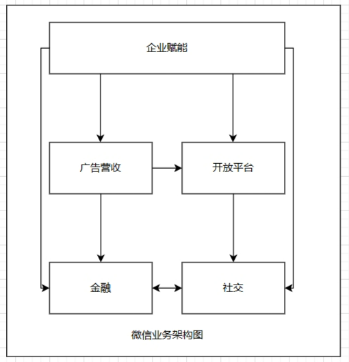
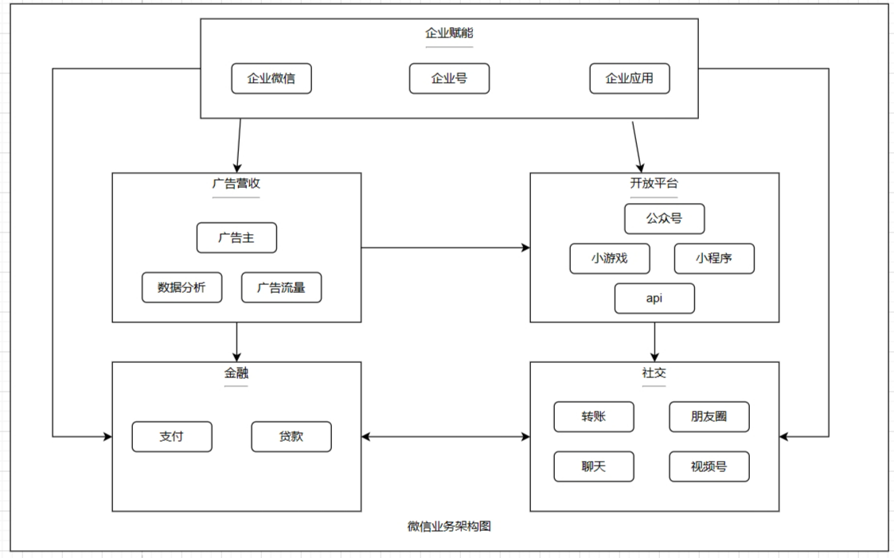
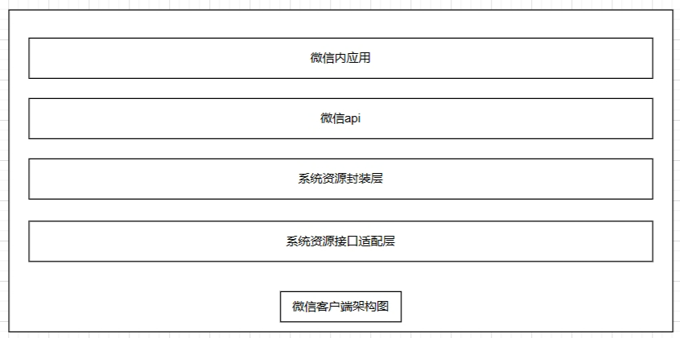
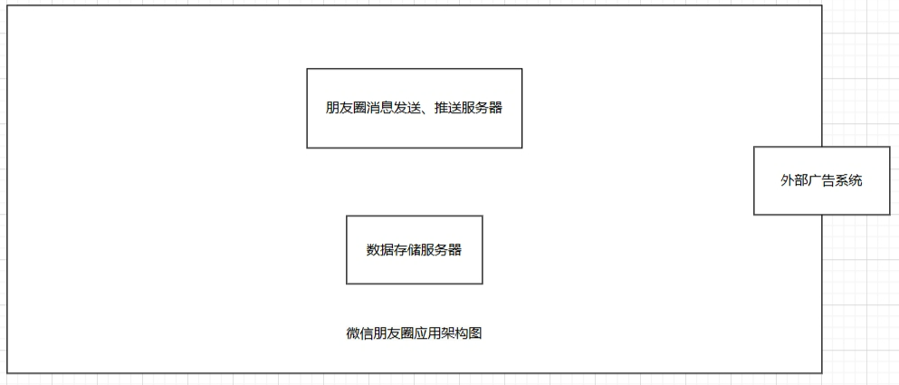
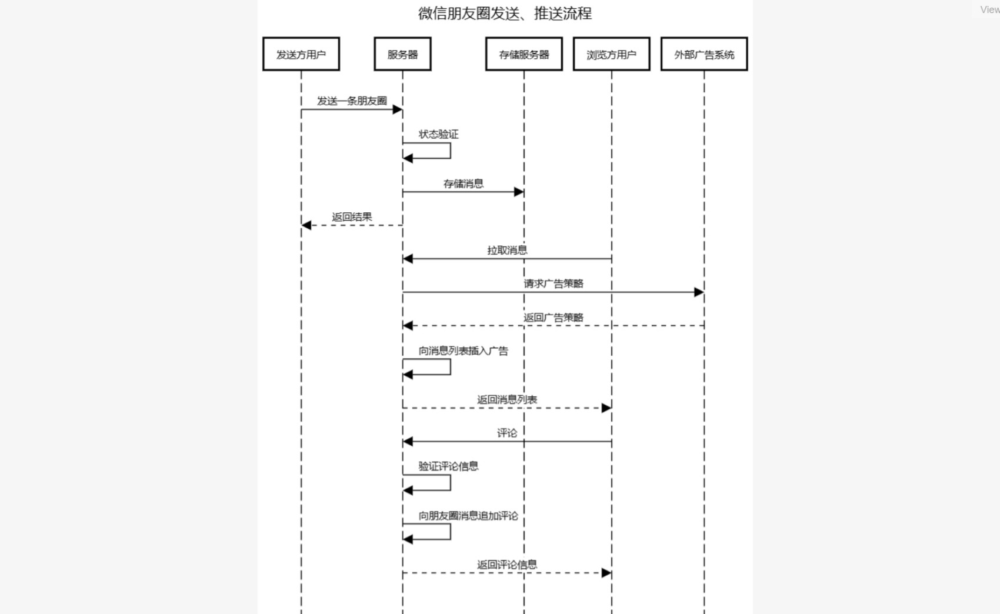
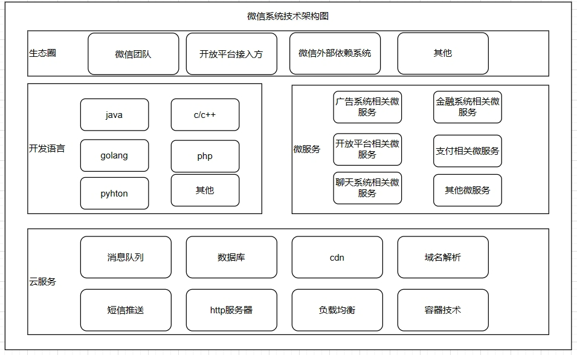
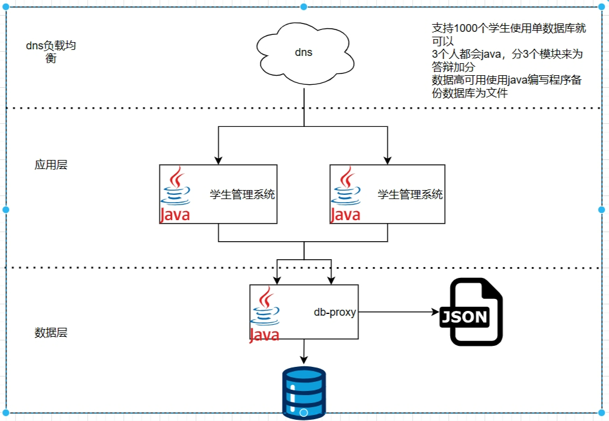
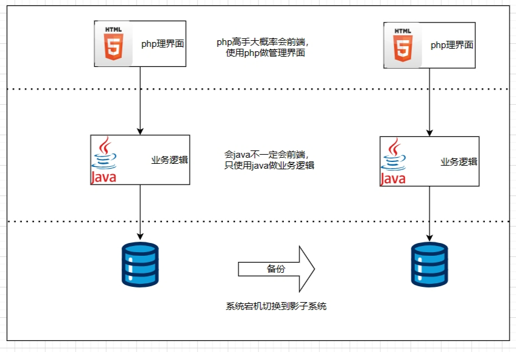

### 作业1
#### 微信业务架构图

#### 微信客户端架构图.png

#### 微信朋友圈应用架构图

#### 微信系统技术架构图

### 作业2
#### 方案1
支持1000个学生使用单数据库就可以。3个人都会java，分3个模块来为答辩加分。数据高可用使用java编写定时脚本程序备份数据库为文件（例如json）
#### 方案2
会java不一定会前端，php高手大概率会前端。
只使用java做业务逻辑，使用php做管理界面
#### 看会前端的是否那个php高手且技术栈是php，如果是则选择方案2，不是则选择方案1
 

