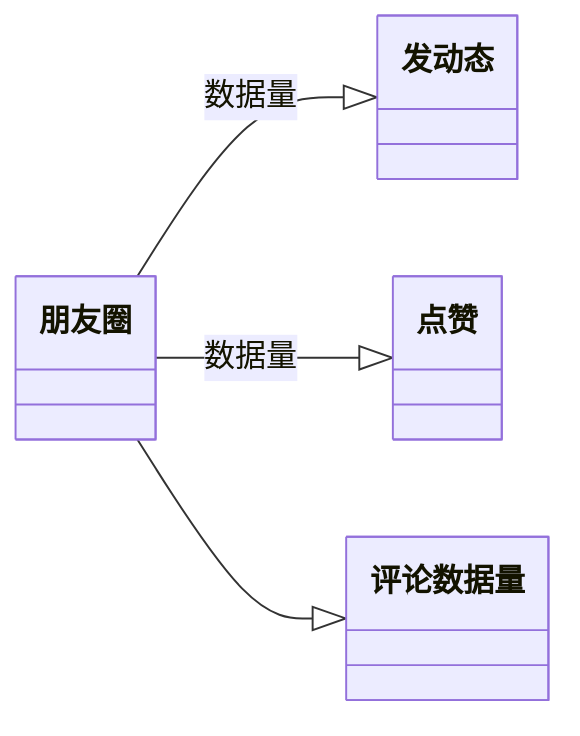
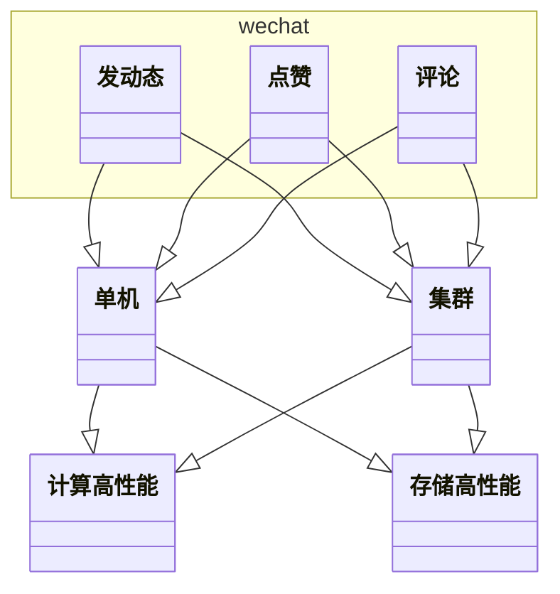

微信朋友圈的复杂度
各个复杂度架构方案
理由

第5课

https://finance.sina.com.cn/chanjing/cyxw/2022-04-19/doc-imcwiwst2783021.shtml

- > 2021年初，微信创始人张小龙披露了一组关于微信使用的数据——每天有10.9亿用户打开微信，有7.8亿用户进入朋友圈，1.2亿用户发布朋友圈。每天，有6.7亿张照片、1亿条短视频被上传到朋友圈。但同时有 2 亿人的朋友圈 3 天可见。\
- > 最新官方数据显示，截至2021年12月31日，微信及WeChat合并月活跃账户数12.68亿，同比再次增长3.5%。\
- > 好友数量的暴增并没有带来相应比例的交流增长。极光大数据的调研结果显示，超过2成用户的好友人数在201-500人之间，甚至有1成用户好友数多于500人。人们的圈子不小，但实际上超过6成用户每周交流的好友数不超过20人。\
- > 随着微信用户基数的增加，理论上朋友圈里面可看的内容也越来越多。从张小龙公布官方数据可以看到，从发布到现在，每天点进朋友圈去看的人一直在增长，并没有停滞的势头。现在每天有 7.5 亿人进入朋友圈，且平均每个人每天要看十几次，所以单日进入的总量达到 100 亿次。\
- > 2017年，微信上线了朋友圈史上最重磅的功能——“朋友圈最近半年/三天可见”。2019年，超1亿人选择朋友圈仅三天可见。2022年，这个数字变成了2亿人。中国青年报社社会调查中心联合问卷网调查中，62.8%的受访者觉得使用此功能省去了不必要的麻烦，51.5%的受访者觉得能更好地保护自己。\
- > 有近6成的受访者表示自己的朋友圈有一半以上的内容都是与工作相关的，不仅有所从事行业的信息，公司的品牌推广，还有客户的广告、营销。更有9.79%的受访者坦言自己的朋友圈已经完全被工作相关的内容攻占。“被公司要求发广告”使朋友圈成为营销、传销圈；“朋友圈被工作内容刷屏”等行为也在不同程度被职场精英反感。

